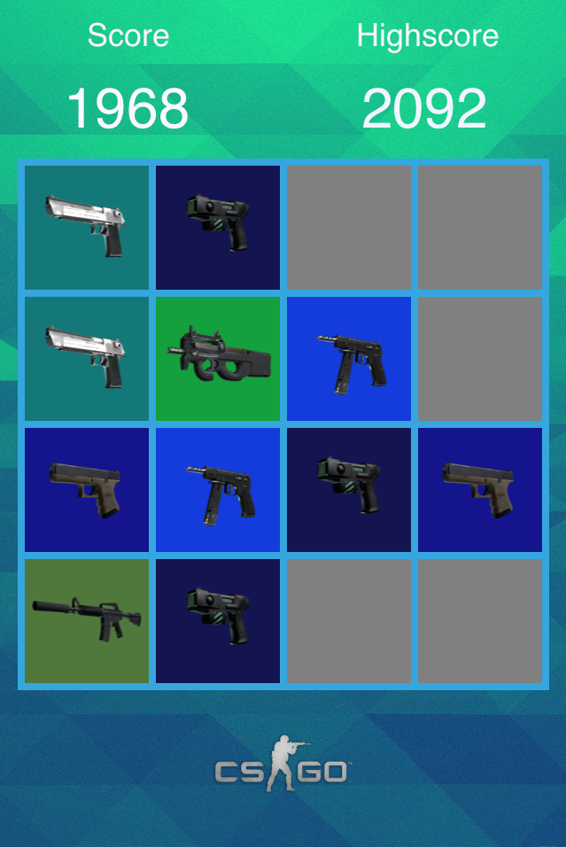

CSGO: GunGame Mobile
===========================
The terrorists have planted the bomb. Can you combine guns and solve the puzzle to find the defuse kit and save the day?

Inspiration
I have been a CS player for quite a long time and one of the fun aspects of the game is a mode called "gun game" where the player starts with an incredibly bad gun and, as they get kills, slowly move up to stronger and stronger guns until eventually they reach a golden grenade or a golden knife. The classic way to play CS is a bomb plant/defusal mission depending on whether you are a terrorist or a counter-terrorist. This game is a spinoff inspired by both game modes and the popular puzzle game 2048.

Future Plans
Currently, the Valve/Steam API is limited but they have stated that they plan to improve it in the future. I would really like to try to get in-game effects tied to this mobile version. For instance, anytime someone on the team solves the puzzle and defuses the bomb, everyone in the PC game gets an extra grenade or slightly faster reload speed. Currently this isn't possible but I hope it will be in the future.
